# Exxonim Architecture, Runtime, and Deployment Guide

Date: 2026-04-05
Project: `exxonim`
State: verified against the frontend repo in `exxonim/`, the sibling backend repo in `../exxonim_backend/`, and the local runtime confirmed on April 4, 2026, with the documentation consolidated on April 5, 2026.

## Verified Runtime On 2026-04-04

The local stack was started again and the following runtime was confirmed:

- Public frontend: `http://127.0.0.1:5173`
- Admin frontend: `http://127.0.0.1:3039`
- Backend API: `http://127.0.0.1:8000`
- Local PostgreSQL: `127.0.0.1:5433`

The following API responses were also verified as working on this Linux machine:

- `GET /api/v1/pages/home`
- `GET /api/v1/site-settings/brand`
- `GET /api/v1/site-settings/footer`
- `GET /api/v1/site-settings/company_info`
- `GET /api/v1/navigation/`
- `GET /api/v1/blog/posts`

That matters because it proves the public site is not using hardcoded content only. It is actively reading content from the backend and the database-backed API.

## 1. Executive Summary

Plain summary in one paragraph:

This project is a content platform split into two major parts: a frontend monorepo and a separate backend API. The frontend monorepo contains the public website, the new admin panel, the legacy admin still being phased out, and shared frontend packages. The backend is a FastAPI application connected to PostgreSQL. The public site reads content from the API. The admin writes content to the API, and the backend persists that content in PostgreSQL. Local development works only when the database, backend, and frontend apps are all running. The frontend deploy assembly is now aligned to package `apps/admin-next`, but the rest of the roadmap should be read as local-first application work plus future deployment handoff requirements, not as a claim that this project is already being operated as a fully hardened production platform today.

## 2. Why This Architecture Exists

This architecture is trying to solve four different problems at once:

1. The public website needs marketing pages, SEO, and content updates.
2. The admin needs a protected workspace for editing content and managing operational data.
3. Shared frontend code should not be duplicated between the public and admin apps.
4. Data must live in a real database, not only in frontend files.

That is why the project is split the way it is.

### Why each main piece exists

| Piece | Why it exists |
| --- | --- |
| `apps/public` | Public marketing website for visitors. |
| `apps/admin-next` | Future admin panel for managing content and operations. |
| `apps/admin` | Legacy admin kept temporarily during migration. |
| `packages/shared` | Shared API routes, base URL logic, HTTP helpers, auth/session primitives, and shared contracts. |
| `packages/admin-core` | Shared admin-specific logic so the new admin is not full of duplicated service code. |
| `../exxonim_backend` | The actual API and persistence layer. This is where the database logic lives. |
| PostgreSQL | Durable storage for pages, blog posts, settings, navigation, jobs, testimonials, pricing, media, and admin-side data. |
| Alembic | Controlled database schema migration. |
| Public prerendering | Better SEO and faster first paint for public routes. |

### Why use a separate backend at all

Because the frontend should not be the system of record.

If content only lived in React files:

- non-developers could not manage it safely
- content changes would require rebuilds every time
- there would be no real admin workflow
- there would be no proper database-backed persistence

The backend makes content editable, queryable, and durable.

## 3. Whole System At A Glance

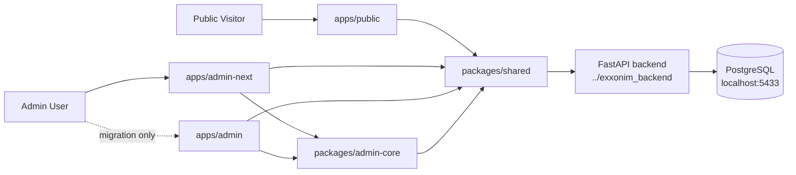

## 4. Repository Shape

```text
Desktop/
├── exxonim/
│   ├── apps/
│   │   ├── public/               # Public website
│   │   ├── admin-next/           # Intended future admin
│   │   └── admin/                # Legacy admin
│   ├── packages/
│   │   ├── shared/               # Shared API/routes/contracts/base URL/auth helpers
│   │   └── admin-core/           # Shared admin domain/services/routes
│   ├── material-kit-react/       # Temporary reference source during migration
│   ├── scripts/                  # Build/deploy helper scripts
│   └── PROJECT_ARCHITECTURE_DIAGRAM.md
└── exxonim_backend/
    ├── app/
    │   ├── core/
    │   ├── crud/
    │   ├── models/
    │   ├── routers/
    │   └── schemas/
    ├── alembic/
    ├── scripts/
    ├── .env
    └── requirements.txt
```

## 5. The Core Architectural Idea

The clean mental model is this:

- the browser never talks to PostgreSQL directly
- the browser talks to the backend API
- the backend API talks to PostgreSQL
- the admin is the write surface
- the public site is mostly the read surface

That one idea explains almost everything in the system.

## 6. What Happens During Local Development

Local development is not "start one thing and it works."

It is a chain:

1. Ensure PostgreSQL is available.
2. Apply migrations and seed foundational data.
3. Start the backend API.
4. Start the public frontend.
5. Start the admin frontend.
6. Open the apps in the browser.

If one link is missing, the chain weakens.

### Local boot sequence

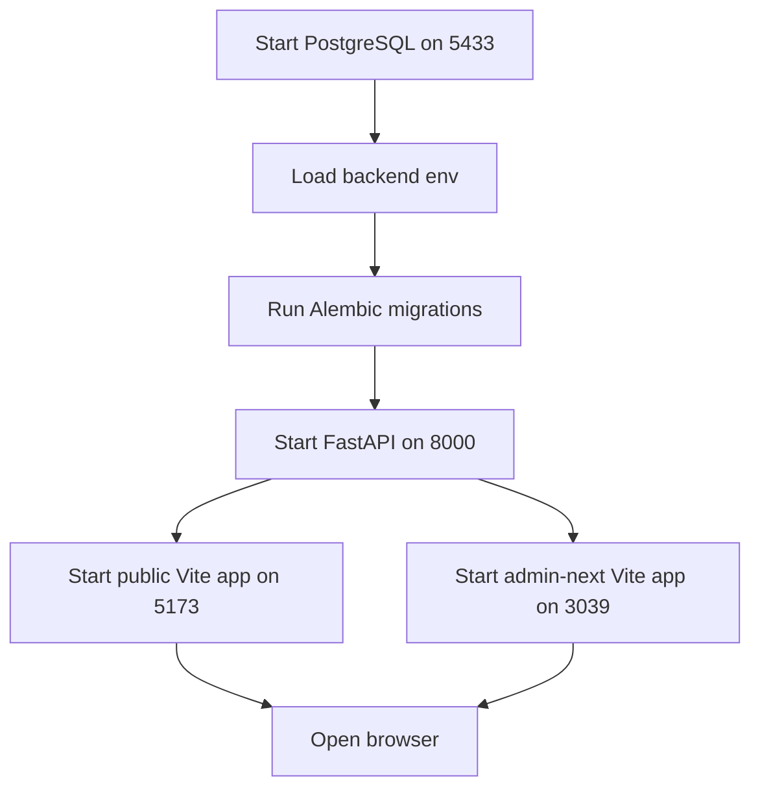

### Why this startup order matters

- PostgreSQL must exist first because the backend depends on it.
- Alembic must run before real API usage so the tables and schema match the code.
- The backend must run before the frontends can load live content correctly.
- The frontends can technically start before the backend, but the public site will show loading and error states instead of real content.

### Local scripts that now support this flow

The repo now has non-Docker helper scripts for the normal local workflow:

- `./scripts/setup-db.sh`
- `./scripts/start-backend.sh`
- `./scripts/start-public.sh`
- `./scripts/start-admin.sh`
- `./scripts/dev.sh`

These matter more than any one machine's `systemctl` command because they express the project-level startup contract instead of assuming one specific workstation setup.

## 7. The Public Read Path, Step By Step

Let us follow one normal public page request.

Imagine a visitor opens the homepage.

### Read flow diagram

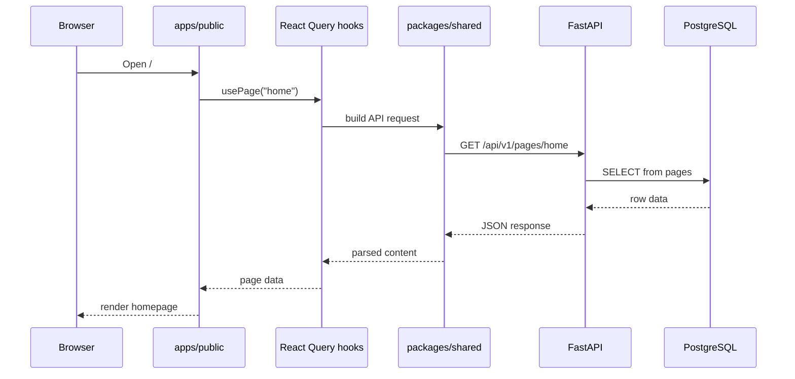

### What code is involved in that path

At a high level:

- `apps/public/src/app/App.tsx` decides which route component to render.
- A page such as `HomePage` calls hooks like `usePage("home")`.
- The hook uses React Query.
- The service calls shared API routes from `packages/shared`.
- Axios sends the request to the backend.
- The backend router reads from PostgreSQL through SQLAlchemy.

### Why this design is useful

Because it separates concerns:

- routing and rendering stay in React
- request orchestration stays in hooks/services
- backend business logic stays in FastAPI
- persistence stays in PostgreSQL

That separation is what makes the system maintainable.

## 8. The Admin Write Path, Step By Step

This is the most important answer for the question "does this save to the DB?"

Yes. The admin save flows are designed to persist to PostgreSQL through backend write endpoints.

### Write flow diagram

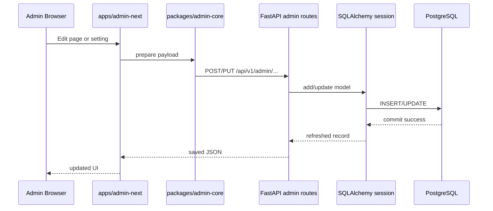

### Why I can say "yes, it saves"

Because the backend admin routes are doing real database work:

- admin page create/update endpoints add models and commit
- admin site-settings endpoints add models and commit
- admin navigation, pricing, testimonials, jobs, media, and blog endpoints also use create/update/delete flows backed by commits

The public site is not inventing this data locally. It reads database-backed API content that the admin is meant to manage.

## 9. What Data Lives In The Database

From the backend models and routes, the database is storing at least these domains:

- pages
- site settings
- navigation items
- blog posts
- blog categories
- blog authors
- career jobs
- pricing plans
- testimonials
- media
- admin users
- consultations and status history

### Public-site-critical data

The public website especially depends on these:

- `pages`
- `site_settings`
- `navigation_items`
- `blog_posts`
- `pricing_plans`
- `testimonials`
- `career_jobs`

That means the public site is not only decorative frontend code. It is strongly API-backed.

## 10. Why Your Data Did Not Follow You From Windows To Linux

This is the key operational answer.

### Short answer

Your code moved through Git.
Your database did not.

### Cross-device reality diagram

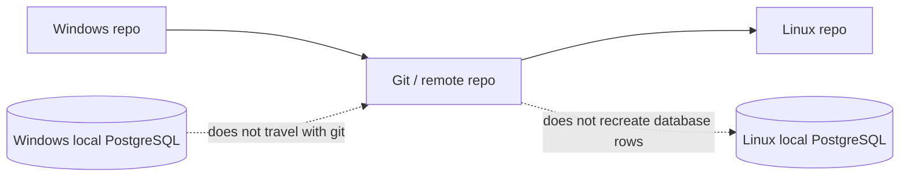

### What Git moves

- source code
- config files that are committed
- docs
- build scripts

### What Git does not move

- your local PostgreSQL data directory
- your actual database rows
- your local uploads folder contents unless explicitly committed
- machine-specific environment state

### What this project is doing on Linux right now

The backend on this Linux machine is configured to use a local PostgreSQL database via:

- `.env` in `../exxonim_backend`
- host `127.0.0.1`
- port `5433`
- database name `Exxonim`

Also, the local PostgreSQL helper script stores the database cluster under:

- `${HOME}/.local/share/exxonim-postgres/data`

That is a machine-local storage location. It is not part of your Git push.

### Important extra detail

The repo examples are now aligned around the local database name `Exxonim`, which removes one source of confusion.

But the deeper cross-device reality is still the same:

- each machine can have its own local `.env`
- each machine can have its own local PostgreSQL cluster
- Git still does not move database rows between them

So two different devices can still end up talking to different local databases even if the codebase looks the same.

### What the verified data suggests

The Linux machine returned public content records with timestamps like:

- `2026-04-04T07:11:33...`

That strongly suggests this Linux machine has its own locally seeded data set created on April 4, 2026, rather than a synchronized copy of the Windows database.

### Therefore, why "nothing was there" on Linux

The most likely reasons are:

1. Windows had a local database with your content.
2. You pushed the code only.
3. Linux cloned or pulled the code, but not the Windows database.
4. Linux either had an empty DB, a different DB name, or a newly seeded DB with different content.

That is expected behavior when using local databases on separate machines.

### How to avoid this in the future

You have three real options:

1. Use one shared remote database for both devices.
2. Export/import the PostgreSQL database when moving machines.
3. Treat local DBs as disposable and rely on seed scripts for demo data only.

If you want the exact same content on Windows and Linux, option 1 or 2 is required.

## 11. Public Website Failure Analysis

This is where I will be blunt.

The public site currently depends heavily on the backend for:

- page bodies
- navigation
- brand settings
- footer settings
- company info
- blog content
- pricing
- testimonials
- jobs

That means backend or database failure affects not just one optional widget, but the public shell itself.

### Current failure behavior

From the current code:

- route pages show a `LoadingSpinner` while waiting for page data
- route pages show `ErrorMessage` when data is unavailable
- `Navigation` returns `null` while loading, and an error block when its APIs fail
- `Footer` shows a loading spinner, then an error block if its APIs fail
- some sections such as pricing/testimonials and jobs fail independently inside otherwise working pages

### Current behavior diagram

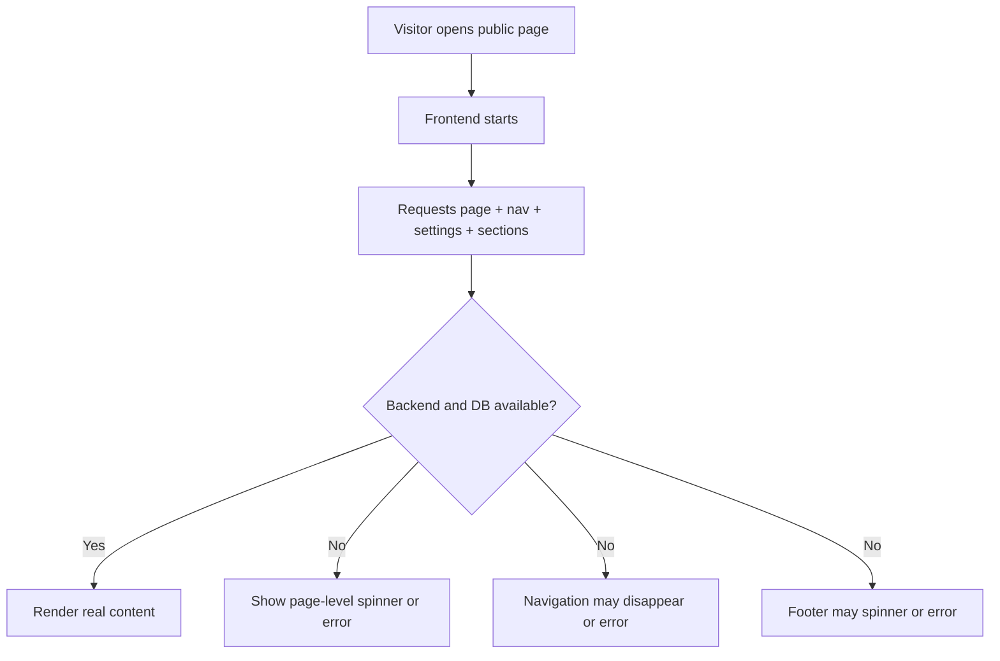

### My critical judgment

Is it best for the public page to hide everything if the backend or DB is down?

No. Not for a public-facing marketing site.

A public site should degrade gracefully, not collapse structurally.

If the backend is down, visitors should still ideally get:

- brand identity
- top navigation
- contact information
- the main value proposition
- at least a cached or static version of core public pages

Right now the system is too dependent on live API availability for the shell itself.

### What is good in the current approach

- errors are at least explicit instead of silent
- failures are localized in several places instead of causing a total React crash
- the user usually sees some feedback rather than a blank white screen

### What is not good

- navigation disappearing while loading is not ideal for orientation
- footer failure removes confidence signals on a public site
- core marketing copy depends on live API responses
- the public shell is not resilient enough for backend outages

### Recommended public-site resilience model

For a stronger public product, I would recommend:

1. Keep a static fallback shell inside the frontend repo.
2. Keep fallback brand settings, contact info, and navigation in the frontend.
3. Use live API data to enhance or replace that fallback when available.
4. Show a small degraded-mode banner when dynamic content is unavailable.
5. Let dynamic sections fail independently without removing the whole shell.

### Better outage strategy diagram

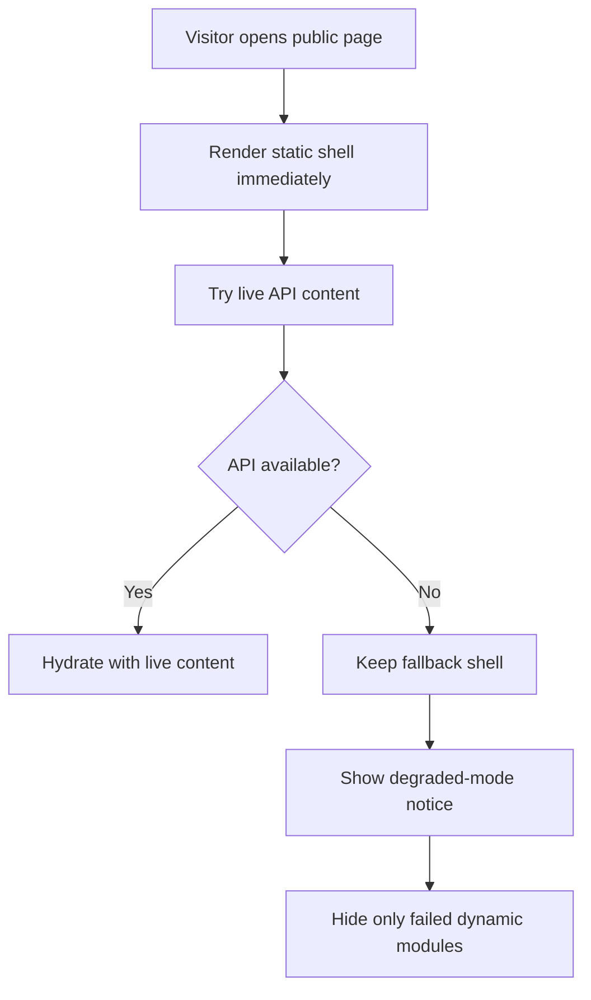

That is the architecture I would trust more for production.

## 12. Loading-State Analysis

You also asked whether it is good to have more than one loading page.

The right answer is:

- yes, if each loading state has a different job
- no, if the user experiences loader-on-top-of-loader confusion

### What exists now

The public app currently has multiple layers of loading behavior:

1. `PageLoader`
   - global boot overlay in `App.tsx`
   - purely frontend-startup oriented
   - not directly tied to API readiness

2. `LoadingSpinner`
   - route-level and section-level data loading
   - used across many pages and components

3. Component-specific loading text
   - for example the jobs block in the career page

4. Local loading suppression logic
   - the spinner registry tries to prevent many concurrent spinners from all showing at once

### My judgment on the current design

It is a bit too fragmented.

The project does not have only "one loading page."
It has:

- a boot overlay
- route-level loading
- section-level loading
- some ad hoc inline loading

That is more than I would want on a polished public site.

### What would be better

I would simplify the model to two levels:

1. One boot-level loader for very first paint only.
2. One consistent section or route skeleton pattern for live data.

I would avoid:

- a global boot loader followed immediately by a second route spinner
- null navigation while waiting
- inconsistent mixes of spinners, text placeholders, and error cards

### Best-practice recommendation

For this project, the cleanest public UX would be:

- immediate shell render
- skeleton sections for content blocks
- persistent navigation and footer fallback
- small inline retry states for failed dynamic modules

That would feel more reliable and more professional.

## 13. Public SEO And Prerendering

The public site is not just a client-side toy app.

It also has a build-time prerendering layer.

### Why that exists

Because public marketing pages need:

- better SEO
- better share metadata
- better first load
- stable route HTML for crawlers

### How it works

The public app:

- builds a client bundle
- builds a server rendering entry
- prerenders routes into static HTML
- generates sitemap and robots files

### Prerendering flow

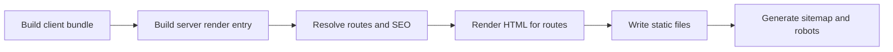

### Important architectural consequence

Even the public build process depends on API-backed content for route SEO and page content decisions.

So this project is not purely static.
It is a database-backed public platform that also prerenders.

## 14. Deployment Alignment Update

This was one of the most important migration mismatches.

The root development aliases already pointed to `apps/admin-next`, and the deploy script has now been corrected to package `apps/admin-next` instead of the legacy admin.

### Historical mismatch diagram

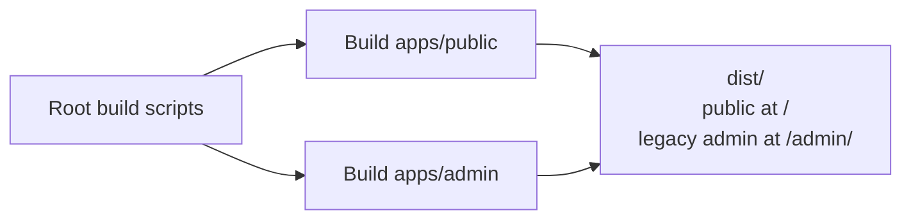

### Correct deploy diagram

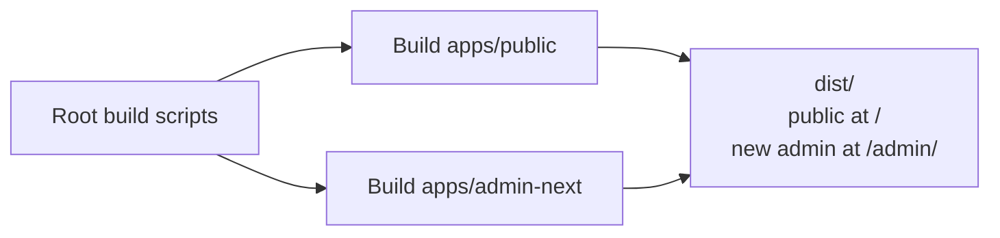

### Why this matters

This closes one real migration bug:

- developers build on `apps/admin-next`
- local development uses `apps/admin-next`
- deploy packaging now also uses `apps/admin-next`

That does not mean the full platform roadmap is complete. It only means the frontend deploy target is now aligned with the intended admin surface.

## 15. What "Launch" Means In This Project

There are really three meanings of launch here:

### 1. Local launch

Start the services on your machine so you can work.

That means:

- PostgreSQL
- backend
- public frontend
- admin frontend

### 2. Build launch

Generate production-ready frontend artifacts.

That means:

- build public app
- build admin app
- prerender public routes
- assemble deploy output

### 3. Real deployment launch

Serve the built public site and admin from a deployed environment backed by a persistent database.

That final step only becomes trustworthy when:

- the production database is stable
- the correct admin is deployed
- public fallback strategy is improved

## 16. The Best Practical Mental Model

If you remember only one diagram, remember this one:

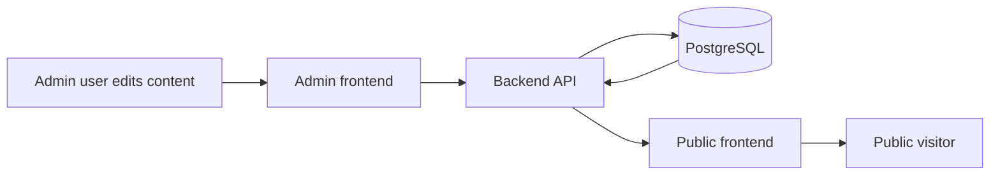

That is the system.

The admin writes.
The database stores.
The public site reads.

## 17. Final Plain-English Takeaway

Here is the honest, plain-language conclusion.

- Yes, this project saves important content to PostgreSQL.
- No, pushing the repo from Windows to Linux does not move the database with it.
- Yes, this explains why code can appear on the second machine while the actual content does not.
- The current public site is visually strong, but architecturally too dependent on a live backend for basic shell content.
- It is acceptable to have more than one loading state, but the current public loading strategy is more fragmented than ideal.
- The frontend deploy packaging is now aligned to `apps/admin-next`, which removes one real migration mismatch.

If you want the system to feel production-strong, the next big improvements should be:

1. Move to a shared or exportable database workflow across devices.
2. Make the public shell resilient when the backend or DB is down.
3. Simplify loading states into a more intentional hierarchy.
4. Finish RBAC, publishing workflow, and audit foundations, then prepare a clean deployment handoff for the future Contabo deployer instead of treating production operations as "done now".

## 18. Realistic Action Plan For Current Stage

This section replaces the earlier "production now" tone with a more honest one.

Current operating reality:

- Exxonim is still being developed and verified locally first.
- Another person is expected to deploy it later to a Contabo server.
- Because of that, the plan should be split into:
  1. core app work
  2. public resilience work
  3. deployment handoff requirements
  4. post-launch hardening

This means the main document should describe what the application must become, while detailed server bootstrapping and operator-specific commands should be kept lighter here and moved into deployer-facing notes.

### Current status snapshot on 2026-04-05

| Item | Status in the current system |
| --- | --- |
| Deploy packages `apps/admin-next` | Done. The deploy assembly now packages `apps/admin-next`. |
| Health endpoints | Done in the backend. `/health/live` and `/health/ready` exist. |
| Temporary write protection before full RBAC | Done in the backend as a temporary guard. |
| RBAC foundations | Done foundationally in the backend and admin UI. Roles, permissions, protected routes, and permission-aware UI are in place. |
| Publishing workflow foundations | Done foundationally for pages, blog posts, and testimonials. More polish is still possible. |
| Basic audit logging | Done foundationally in the backend. Retention and archival are not yet the focus. |
| Legacy admin freeze | Partially done. Deprecation work started, but full removal is later. |
| Public fallback shell and graceful degradation | Partially done. Fallback shell and degraded-mode behavior exist; broader cached last-known-good coverage can still improve. |
| Non-Docker local startup scripts | Done. Root scripts now exist for DB setup, backend, public, admin, full dev startup, and superuser creation. |
| Detailed production operations | Not the current focus. This should now be treated as deployment handoff material for the future Contabo deployer. |

### What Stays In The Main Document

These items still matter now and should stay visible in the architecture plan:

- RBAC
  - keep roles, backend permission checks, role-aware UI, and basic user management
- Health endpoints
  - keep `/health/live` and `/health/ready`
- Legacy-admin cutover
  - keep the principle that legacy admin should stop growing and `admin-next` should become the only real admin surface
- Public-site resilience
  - keep the requirement that homepage, navigation, footer, and other shell-critical content must not collapse just because backend or DB is down
- Basic audit logging
  - keep who changed what, when, and which record was affected

### What Changes From The Earlier Draft

These items should be rewritten, not removed:

- Production deployment becomes deployment handoff requirements
  - the document should no longer sound like the current developer is personally operating the final production server today
- Audit-log archival automation moves to future hardening
  - basic audit logging matters now; retention automation is not a launch blocker while the project is still local-first
- Sentry and external uptime monitoring move to post-launch hardening
  - they remain good ideas, but they should not slow down application correctness
- Ubuntu + nginx + systemd remain recommended assumptions
  - but they should be presented as recommended handoff targets, not fixed commands that assume one exact server layout

### What Is Postponed For Now

These items should not dominate the main architecture document yet:

- detailed server bootstrap commands
- monthly or automated audit-log archival flows
- external uptime monitoring before the app is publicly reachable
- a full observability stack as a pre-launch blocker

### Priority Order

If priorities need to be stated plainly, the practical order should be:

1. application correctness
2. public resilience
3. deployment handoff readiness
4. post-launch hardening

## 19. Core App Work

This is the work that matters even before any Contabo deployment happens.

### Application correctness priorities

| Priority | Task | Why it stays important now |
| --- | --- | --- |
| 1 | Finalize roles and permission matrix | RBAC is an application design concern, not only a server concern. |
| 2 | Keep backend permission enforcement | Frontend hiding is only convenience; backend must decide access. |
| 3 | Keep first-superuser bootstrap path | A secure CLI bootstrap flow is required in local, staging, and production. |
| 4 | Keep basic audit logging | Multiple staff users require accountability even before production hardening. |
| 5 | Continue legacy-admin cutover | Two admins create confusion and split effort. |

### Recommended role model

- `superuser`: full platform access, including role and user management
- `administrator`: operational administration, settings, and publishing control
- `editor`: create and edit drafts, then submit for review
- `reviewer`: approve or reject submitted content
- `viewer`: read-only back-office access

If a dedicated `publisher` role is needed later, it can be added as a separate permission grouping, but it should not complicate the current stage unnecessarily.

### Core design principles that still apply

- Backend enforces every permission.
- Publishing workflow applies to public content.
- Audit logs are append-only and never user-editable.
- Fine-grained permissions should remain possible even if the first version is role-led.
- No Docker is required for the local development model.

## 20. Public Resilience Work

This remains one of the most important product concerns.

The public site should not become blank just because backend or DB is unavailable.

### Public resilience priorities

| Priority | Task | Intended result |
| --- | --- | --- |
| 1 | Keep fallback shell for homepage, nav, footer, and brand | Visitors always see a coherent public shell. |
| 2 | Add or improve cached last-known-good content | Previously successful content can still be shown during outages. |
| 3 | Keep graceful fallback for blog basics and core public pages | Public content should degrade, not disappear. |
| 4 | Keep health endpoints | Local testing and future deployment checks become easier immediately. |
| 5 | Keep cleaner loading hierarchy | Avoid loader-on-loader confusion and maintain shell stability. |

### Practical resilience direction

- render a shell immediately
- keep fallback navigation, footer, and company basics in the frontend
- hydrate with live API content when available
- preserve last-known-good content where practical
- let dynamic sections fail independently instead of collapsing the whole page

## 21. Deployment Handoff Requirements

This is the right framing for server work at the current stage.

It should not read as:

- "we are personally running the final production platform right now"

It should read as:

- "these are the requirements the future Contabo deployer should satisfy"

### Recommended deployment target

| Area | Requirement |
| --- | --- |
| Target OS | Ubuntu LTS preferred |
| Reverse proxy | `nginx` recommended |
| Backend process manager | `systemd` recommended |
| Database | PostgreSQL required |
| TLS | Domain plus SSL required |
| Health checks | `/health/live` and `/health/ready` must be reachable |
| Frontend deploy target | Public site at `/`, `admin-next` at `/admin/` |
| Database migrations | Alembic upgrade required during deployment |
| Admin bootstrap | First superuser must be created by CLI, not public signup |
| Backups | Database backup strategy must exist before real production usage |

### Required environment inputs

The deployer should receive or define these values before deployment:

- `DATABASE_URL`
- `ADMIN_API_KEY`
- `JWT_SECRET`
- `JWT_ALGORITHM`
- `ACCESS_TOKEN_EXPIRE_MINUTES`
- `REFRESH_TOKEN_EXPIRE_DAYS`
- `CORS_ORIGINS`
- `PUBLIC_SITE_URL`
- `VITE_API_URL`
- `VITE_ADMIN_API_KEY`

For local-first root scripts, these values may also be relevant:

- `EXXONIM_BACKEND_DIR`
- `POSTGRES_HOST`
- `POSTGRES_PORT`
- `POSTGRES_ADMIN_USER`
- `POSTGRES_APP_USER`
- `POSTGRES_APP_PASSWORD`
- `POSTGRES_DB_NAME`
- `PUBLIC_DEV_PORT`
- `ADMIN_DEV_PORT`
- `BACKEND_DEV_PORT`
- `BACKEND_HTTP_URL`

### Required application-level handoff items

The deployer should receive a short, practical checklist:

- environment variable list
- backend repo path and frontend repo path
- build commands
- backend run command
- migration command
- role/permission seed command
- first-superuser creation command
- health endpoints
- public URL, admin URL, and API routing expectations
- DB backup expectation

### Recommended handoff commands

These are application commands, not a full server runbook:

- full local dev startup: `./scripts/dev.sh`
- DB setup: `./scripts/setup-db.sh`
- backend only: `./scripts/start-backend.sh`
- public only: `./scripts/start-public.sh`
- admin only: `./scripts/start-admin.sh`
- first superuser: `./scripts/create-superuser.sh`
- deploy build artifact: `npm run build:deploy`

The future server operator may wrap these in `systemd`, `nginx`, or other hosting conventions, but those wrapper details should not dominate this architecture guide.

### Deployment smoke test checklist

After deployment, the deployer should verify:

- the public homepage loads from `/`
- the admin login loads from `/admin/`
- the backend responds normally
- `GET /health/live` returns `200`
- `GET /health/ready` returns `200`
- login works for the first CLI-created superuser
- at least one protected admin write succeeds for an authorized user
- the public shell still renders if dynamic backend content is temporarily unavailable

## 22. Post-Launch Hardening

These items are still valuable, but they should follow first real deployment rather than block it.

### Move these here instead of "must-have now"

- Sentry or similar error tracking
- external uptime monitoring such as UptimeRobot
- audit-log archival automation and long-term retention tooling
- deeper observability and structured monitoring stack
- full legacy-admin removal after stable cutover

### Audit-log retention stance at the current stage

The target can still be:

- keep audit logs for 1 year

But the implementation stance right now should be:

- keep audit logs in the database
- review volume later
- archive only when volume becomes a real operational issue

That makes retention a future hardening concern, not a blocker for current application correctness.

## 23. Detailed Permission Reference

This section replaces the removed standalone permission matrix file.

It is the documentation-level reference for which roles are supposed to do what. The backend remains the real enforcement layer.

Legend:

- `✓` allowed
- `✗` not allowed

### Role principles

- `superuser` can do everything, including role and permission administration.
- `administrator` manages operations, settings, publishing, and normal admin governance.
- `editor` creates and updates draft content, then submits it for review.
- `reviewer` approves or rejects submitted public content.
- `viewer` has read-only back-office access where read access is granted.

### Permission matrix

| Permission Code | Module | Action | Superuser | Administrator | Editor | Reviewer | Viewer |
| --- | --- | --- | --- | --- | --- | --- | --- |
| `dashboard.read` | Dashboard | View the admin dashboard | ✓ | ✓ | ✓ | ✓ | ✓ |
| `page.read` | Pages | View page records in admin | ✓ | ✓ | ✓ | ✓ | ✓ |
| `page.create` | Pages | Create a page draft | ✓ | ✓ | ✓ | ✗ | ✗ |
| `page.edit_own_draft` | Pages | Edit a draft page you created | ✓ | ✓ | ✓ | ✗ | ✗ |
| `page.edit_any_draft` | Pages | Edit any draft page | ✓ | ✓ | ✗ | ✗ | ✗ |
| `page.submit_review` | Pages | Submit a page for review | ✓ | ✓ | ✓ | ✗ | ✗ |
| `page.approve` | Pages | Approve a page in review | ✓ | ✓ | ✗ | ✓ | ✗ |
| `page.reject` | Pages | Reject a page in review | ✓ | ✓ | ✗ | ✓ | ✗ |
| `page.publish` | Pages | Publish or unpublish a page | ✓ | ✓ | ✗ | ✗ | ✗ |
| `page.archive` | Pages | Archive a page | ✓ | ✓ | ✗ | ✗ | ✗ |
| `page.delete` | Pages | Delete a page | ✓ | ✓ | ✗ | ✗ | ✗ |
| `blog_post.read` | Blog posts | View blog post records in admin | ✓ | ✓ | ✓ | ✓ | ✓ |
| `blog_post.create` | Blog posts | Create a blog post draft | ✓ | ✓ | ✓ | ✗ | ✗ |
| `blog_post.edit_own_draft` | Blog posts | Edit a draft blog post you created | ✓ | ✓ | ✓ | ✗ | ✗ |
| `blog_post.edit_any_draft` | Blog posts | Edit any draft blog post | ✓ | ✓ | ✗ | ✗ | ✗ |
| `blog_post.submit_review` | Blog posts | Submit a blog post for review | ✓ | ✓ | ✓ | ✗ | ✗ |
| `blog_post.approve` | Blog posts | Approve a blog post in review | ✓ | ✓ | ✗ | ✓ | ✗ |
| `blog_post.reject` | Blog posts | Reject a blog post in review | ✓ | ✓ | ✗ | ✓ | ✗ |
| `blog_post.publish` | Blog posts | Publish or unpublish a blog post | ✓ | ✓ | ✗ | ✗ | ✗ |
| `blog_post.archive` | Blog posts | Archive a blog post | ✓ | ✓ | ✗ | ✗ | ✗ |
| `blog_post.delete` | Blog posts | Delete a blog post | ✓ | ✓ | ✗ | ✗ | ✗ |
| `blog_category.read` | Blog categories | View blog categories | ✓ | ✓ | ✓ | ✓ | ✓ |
| `blog_category.manage` | Blog categories | Create, update, or delete categories | ✓ | ✓ | ✗ | ✗ | ✗ |
| `blog_author.read` | Blog authors | View blog authors | ✓ | ✓ | ✓ | ✓ | ✓ |
| `blog_author.manage` | Blog authors | Create, update, or delete authors | ✓ | ✓ | ✗ | ✗ | ✗ |
| `testimonial.read` | Testimonials | View testimonial records in admin | ✓ | ✓ | ✓ | ✓ | ✓ |
| `testimonial.create` | Testimonials | Create a testimonial draft | ✓ | ✓ | ✓ | ✗ | ✗ |
| `testimonial.edit_own_draft` | Testimonials | Edit a draft testimonial you created | ✓ | ✓ | ✓ | ✗ | ✗ |
| `testimonial.edit_any_draft` | Testimonials | Edit any draft testimonial | ✓ | ✓ | ✗ | ✗ | ✗ |
| `testimonial.submit_review` | Testimonials | Submit a testimonial for review | ✓ | ✓ | ✓ | ✗ | ✗ |
| `testimonial.approve` | Testimonials | Approve a testimonial in review | ✓ | ✓ | ✗ | ✓ | ✗ |
| `testimonial.reject` | Testimonials | Reject a testimonial in review | ✓ | ✓ | ✗ | ✓ | ✗ |
| `testimonial.publish` | Testimonials | Publish or unpublish a testimonial | ✓ | ✓ | ✗ | ✗ | ✗ |
| `testimonial.archive` | Testimonials | Archive a testimonial | ✓ | ✓ | ✗ | ✗ | ✗ |
| `testimonial.delete` | Testimonials | Delete a testimonial | ✓ | ✓ | ✗ | ✗ | ✗ |
| `media.read` | Media | View the media library | ✓ | ✓ | ✓ | ✓ | ✓ |
| `media.create` | Media | Upload or create media | ✓ | ✓ | ✓ | ✓ | ✗ |
| `media.update` | Media | Update media metadata | ✓ | ✓ | ✓ | ✓ | ✗ |
| `media.delete` | Media | Delete media | ✓ | ✓ | ✗ | ✗ | ✗ |
| `navigation.read` | Navigation | View navigation items | ✓ | ✓ | ✓ | ✓ | ✓ |
| `navigation.create` | Navigation | Create a navigation item | ✓ | ✓ | ✗ | ✗ | ✗ |
| `navigation.update` | Navigation | Update a navigation item | ✓ | ✓ | ✗ | ✗ | ✗ |
| `navigation.delete` | Navigation | Delete a navigation item | ✓ | ✓ | ✗ | ✗ | ✗ |
| `pricing.read` | Pricing | View pricing plans | ✓ | ✓ | ✓ | ✓ | ✓ |
| `pricing.create` | Pricing | Create a pricing plan | ✓ | ✓ | ✗ | ✗ | ✗ |
| `pricing.update` | Pricing | Update a pricing plan | ✓ | ✓ | ✗ | ✗ | ✗ |
| `pricing.delete` | Pricing | Delete a pricing plan | ✓ | ✓ | ✗ | ✗ | ✗ |
| `job.read` | Careers | View job openings | ✓ | ✓ | ✓ | ✓ | ✓ |
| `job.create` | Careers | Create a job opening | ✓ | ✓ | ✗ | ✗ | ✗ |
| `job.update` | Careers | Update a job opening | ✓ | ✓ | ✗ | ✗ | ✗ |
| `job.delete` | Careers | Delete a job opening | ✓ | ✓ | ✗ | ✗ | ✗ |
| `site_setting.read` | Site settings | View site settings | ✓ | ✓ | ✗ | ✗ | ✗ |
| `site_setting.create` | Site settings | Create a site setting | ✓ | ✓ | ✗ | ✗ | ✗ |
| `site_setting.update` | Site settings | Update a site setting | ✓ | ✓ | ✗ | ✗ | ✗ |
| `site_setting.delete` | Site settings | Delete a site setting | ✓ | ✓ | ✗ | ✗ | ✗ |
| `consultation.read` | Consultations | View consultation records | ✓ | ✓ | ✗ | ✗ | ✗ |
| `consultation.update` | Consultations | Update consultation status or assignee | ✓ | ✓ | ✗ | ✗ | ✗ |
| `user.read` | Users | View admin users | ✓ | ✓ | ✗ | ✗ | ✗ |
| `user.manage` | Users | Create, update, activate, or deactivate users | ✓ | ✓ | ✗ | ✗ | ✗ |
| `role.read` | Roles | View roles and role-permission mappings | ✓ | ✓ | ✗ | ✗ | ✗ |
| `role.manage` | Roles | Create roles and change role-permission mappings | ✓ | ✗ | ✗ | ✗ | ✗ |
| `audit_log.read` | Audit log | View append-only audit history | ✓ | ✓ | ✗ | ✗ | ✗ |

### Workflow notes

- Publishing workflow applies to `page`, `blog_post`, and `testimonial`.
- Public API routes should expose only `published` records.
- `edit_own_draft` applies only when the current user created the record and the record is still in an editable workflow state.
- `role.manage` stays restricted to `superuser` so the permission model remains tightly controlled.

## 24. Plain-English Operational Interpretation

If someone asks, "What should this document be used for now?" the honest answer is:

- use it to guide core application work
- use it to guide public-site resilience work
- use it to prepare a clean deployment handoff for the future Contabo deployer
- do not use it as proof that the current developer is already operating a fully hardened production platform today

That is the realistic and useful posture for Exxonim at this stage.
