# Exxonim Architecture, Runtime, and Deployment Guide

Date: 2026-04-04
Project: `exxonim`
State: verified against the frontend repo in `exxonim/`, the sibling backend repo in `../exxonim_backend/`, and the local stack started on April 4, 2026.

## Verified Runtime On 2026-04-04

The local stack was started again and the following runtime was confirmed:

- Public frontend: `http://127.0.0.1:5173`
- Admin frontend: `http://127.0.0.1:3039`
- Backend API: `http://127.0.0.1:8000`
- Local PostgreSQL: `127.0.0.1:5433`

The following API responses were also verified as working on this Linux machine:

- `GET /api/v1/pages/home`
- `GET /api/v1/site-settings/brand`
- `GET /api/v1/site-settings/footer`
- `GET /api/v1/site-settings/company_info`
- `GET /api/v1/navigation/`
- `GET /api/v1/blog/posts`

That matters because it proves the public site is not using hardcoded content only. It is actively reading content from the backend and the database-backed API.

## 1. Executive Summary

Professor-style version, in one paragraph:

This project is a content platform split into two major parts: a frontend monorepo and a separate backend API. The frontend monorepo contains the public website, the new admin panel, the legacy admin still being phased out, and shared frontend packages. The backend is a FastAPI application connected to PostgreSQL. The public site reads content from the API. The admin writes content to the API, and the backend persists that content in PostgreSQL. Local development works only when the database, backend, and frontend apps are all running. Deployment is not fully aligned yet, because the current deploy assembly still packages the legacy admin instead of `apps/admin-next`.

## 2. Why This Architecture Exists

This architecture is trying to solve four different problems at once:

1. The public website needs marketing pages, SEO, and content updates.
2. The admin needs a protected workspace for editing content and managing operational data.
3. Shared frontend code should not be duplicated between the public and admin apps.
4. Data must live in a real database, not only in frontend files.

That is why the project is split the way it is.

### Why each main piece exists

| Piece | Why it exists |
| --- | --- |
| `apps/public` | Public marketing website for visitors. |
| `apps/admin-next` | Future admin panel for managing content and operations. |
| `apps/admin` | Legacy admin kept temporarily during migration. |
| `packages/shared` | Shared API routes, base URL logic, HTTP helpers, auth/session primitives, and shared contracts. |
| `packages/admin-core` | Shared admin-specific logic so the new admin is not full of duplicated service code. |
| `../exxonim_backend` | The actual API and persistence layer. This is where the database logic lives. |
| PostgreSQL | Durable storage for pages, blog posts, settings, navigation, jobs, testimonials, pricing, media, and admin-side data. |
| Alembic | Controlled database schema migration. |
| Public prerendering | Better SEO and faster first paint for public routes. |

### Why use a separate backend at all

Because the frontend should not be the system of record.

If content only lived in React files:

- non-developers could not manage it safely
- content changes would require rebuilds every time
- there would be no real admin workflow
- there would be no proper database-backed persistence

The backend makes content editable, queryable, and durable.

## 3. Whole System At A Glance

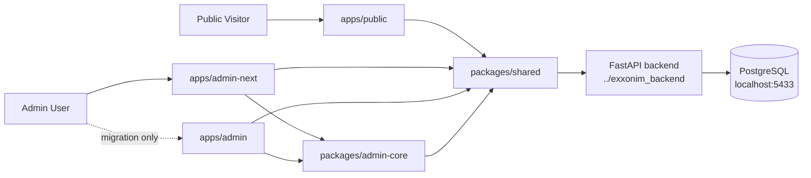

## 4. Repository Shape

```text
Desktop/
├── exxonim/
│   ├── apps/
│   │   ├── public/               # Public website
│   │   ├── admin-next/           # Intended future admin
│   │   └── admin/                # Legacy admin
│   ├── packages/
│   │   ├── shared/               # Shared API/routes/contracts/base URL/auth helpers
│   │   └── admin-core/           # Shared admin domain/services/routes
│   ├── material-kit-react/       # Temporary reference source during migration
│   ├── scripts/                  # Build/deploy helper scripts
│   └── PROJECT_ARCHITECTURE_DIAGRAM.md
└── exxonim_backend/
    ├── app/
    │   ├── core/
    │   ├── crud/
    │   ├── models/
    │   ├── routers/
    │   └── schemas/
    ├── alembic/
    ├── scripts/
    ├── .env
    └── requirements.txt
```

## 5. The Core Architectural Idea

The clean mental model is this:

- the browser never talks to PostgreSQL directly
- the browser talks to the backend API
- the backend API talks to PostgreSQL
- the admin is the write surface
- the public site is mostly the read surface

That one idea explains almost everything in the system.

## 6. What Happens During Local Development

Local development is not "start one thing and it works."

It is a chain:

1. Start PostgreSQL.
2. Apply migrations.
3. Start the backend API.
4. Start the public frontend.
5. Start the admin frontend.
6. Open the apps in the browser.

If one link is missing, the chain weakens.

### Local boot sequence

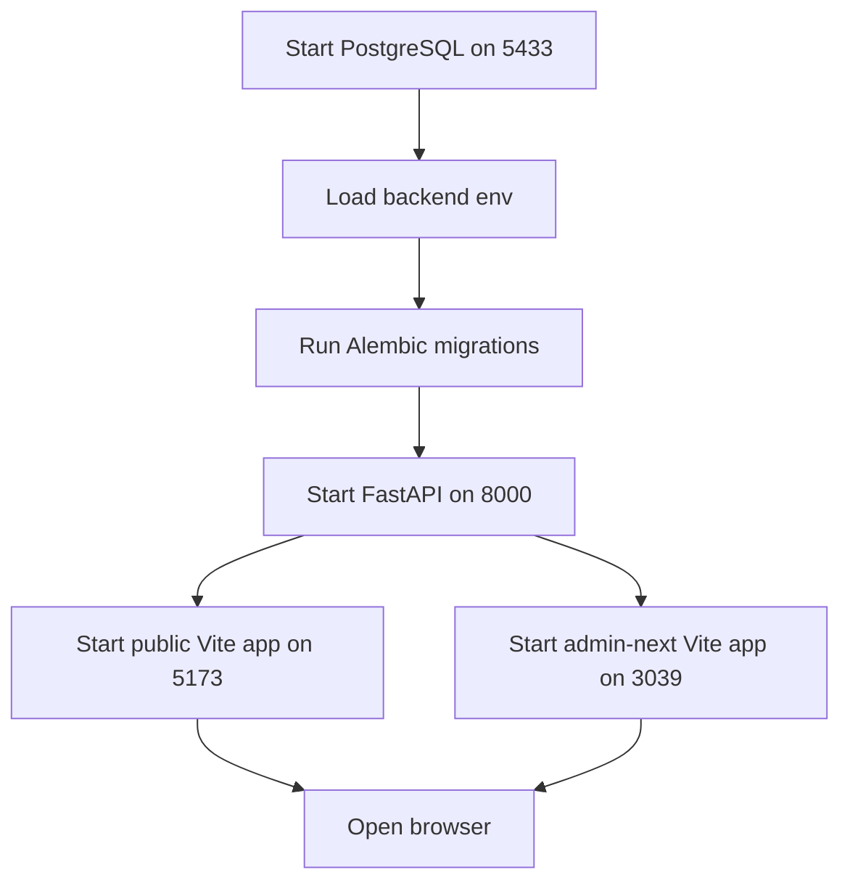

### Why this startup order matters

- PostgreSQL must exist first because the backend depends on it.
- Alembic must run before real API usage so the tables and schema match the code.
- The backend must run before the frontends can load live content correctly.
- The frontends can technically start before the backend, but the public site will show loading and error states instead of real content.

## 7. The Public Read Path, Step By Step

Let us follow one normal public page request.

Imagine a visitor opens the homepage.

### Read flow diagram

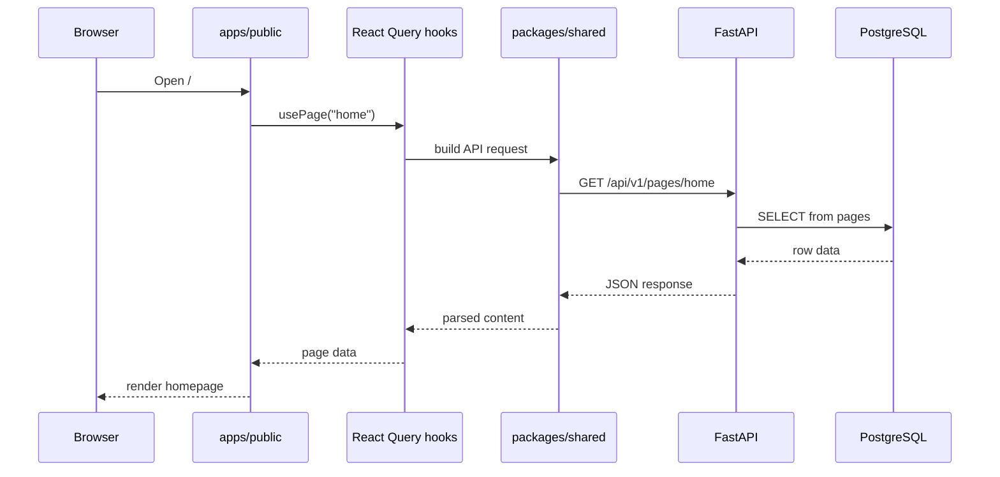

### What code is involved in that path

At a high level:

- `apps/public/src/app/App.tsx` decides which route component to render.
- A page such as `HomePage` calls hooks like `usePage("home")`.
- The hook uses React Query.
- The service calls shared API routes from `packages/shared`.
- Axios sends the request to the backend.
- The backend router reads from PostgreSQL through SQLAlchemy.

### Why this design is useful

Because it separates concerns:

- routing and rendering stay in React
- request orchestration stays in hooks/services
- backend business logic stays in FastAPI
- persistence stays in PostgreSQL

That separation is what makes the system maintainable.

## 8. The Admin Write Path, Step By Step

This is the most important answer for the question "does this save to the DB?"

Yes. The admin save flows are designed to persist to PostgreSQL through backend write endpoints.

### Write flow diagram

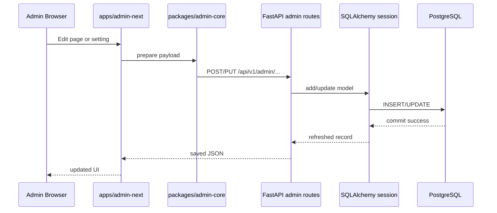

### Why I can say "yes, it saves"

Because the backend admin routes are doing real database work:

- admin page create/update endpoints add models and commit
- admin site-settings endpoints add models and commit
- admin navigation, pricing, testimonials, jobs, media, and blog endpoints also use create/update/delete flows backed by commits

The public site is not inventing this data locally. It reads database-backed API content that the admin is meant to manage.

## 9. What Data Lives In The Database

From the backend models and routes, the database is storing at least these domains:

- pages
- site settings
- navigation items
- blog posts
- blog categories
- blog authors
- career jobs
- pricing plans
- testimonials
- media
- admin users
- consultations and status history

### Public-site-critical data

The public website especially depends on these:

- `pages`
- `site_settings`
- `navigation_items`
- `blog_posts`
- `pricing_plans`
- `testimonials`
- `career_jobs`

That means the public site is not only decorative frontend code. It is strongly API-backed.

## 10. Why Your Data Did Not Follow You From Windows To Linux

This is the key operational answer.

### Short answer

Your code moved through Git.
Your database did not.

### Cross-device reality diagram

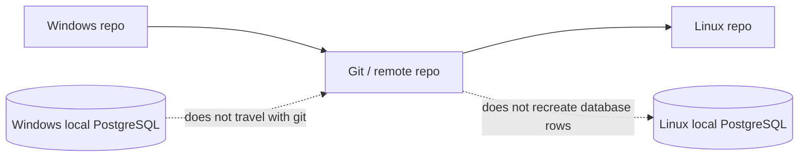

### What Git moves

- source code
- config files that are committed
- docs
- build scripts

### What Git does not move

- your local PostgreSQL data directory
- your actual database rows
- your local uploads folder contents unless explicitly committed
- machine-specific environment state

### What this project is doing on Linux right now

The backend on this Linux machine is configured to use a local PostgreSQL database via:

- `.env` in `../exxonim_backend`
- host `127.0.0.1`
- port `5433`
- database name `Exxonim`

Also, the local PostgreSQL helper script stores the database cluster under:

- `${HOME}/.local/share/exxonim-postgres/data`

That is a machine-local storage location. It is not part of your Git push.

### Important extra detail

There is also a naming mismatch in the backend materials:

- `../exxonim_backend/.env.example` and the backend README refer to `marketing_site_dev`
- the actual Linux `.env` currently points to `Exxonim`

So two different devices can easily end up talking to different local databases even if the codebase looks the same.

### What the verified data suggests

The Linux machine returned public content records with timestamps like:

- `2026-04-04T07:11:33...`

That strongly suggests this Linux machine has its own locally seeded data set created on April 4, 2026, rather than a synchronized copy of the Windows database.

### Therefore, why "nothing was there" on Linux

The most likely reasons are:

1. Windows had a local database with your content.
2. You pushed the code only.
3. Linux cloned or pulled the code, but not the Windows database.
4. Linux either had an empty DB, a different DB name, or a newly seeded DB with different content.

That is expected behavior when using local databases on separate machines.

### How to avoid this in the future

You have three real options:

1. Use one shared remote database for both devices.
2. Export/import the PostgreSQL database when moving machines.
3. Treat local DBs as disposable and rely on seed scripts for demo data only.

If you want the exact same content on Windows and Linux, option 1 or 2 is required.

## 11. Public Website Failure Analysis

This is where I will be blunt.

The public site currently depends heavily on the backend for:

- page bodies
- navigation
- brand settings
- footer settings
- company info
- blog content
- pricing
- testimonials
- jobs

That means backend or database failure affects not just one optional widget, but the public shell itself.

### Current failure behavior

From the current code:

- route pages show a `LoadingSpinner` while waiting for page data
- route pages show `ErrorMessage` when data is unavailable
- `Navigation` returns `null` while loading, and an error block when its APIs fail
- `Footer` shows a loading spinner, then an error block if its APIs fail
- some sections such as pricing/testimonials and jobs fail independently inside otherwise working pages

### Current behavior diagram

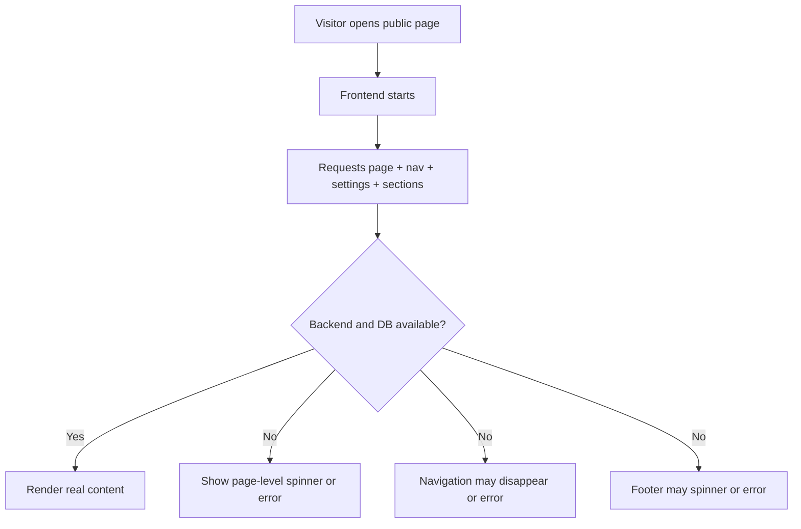

### My critical judgment

Is it best for the public page to hide everything if the backend or DB is down?

No. Not for a public-facing marketing site.

A public site should degrade gracefully, not collapse structurally.

If the backend is down, visitors should still ideally get:

- brand identity
- top navigation
- contact information
- the main value proposition
- at least a cached or static version of core public pages

Right now the system is too dependent on live API availability for the shell itself.

### What is good in the current approach

- errors are at least explicit instead of silent
- failures are localized in several places instead of causing a total React crash
- the user usually sees some feedback rather than a blank white screen

### What is not good

- navigation disappearing while loading is not ideal for orientation
- footer failure removes confidence signals on a public site
- core marketing copy depends on live API responses
- the public shell is not resilient enough for backend outages

### Recommended public-site resilience model

For a stronger public product, I would recommend:

1. Keep a static fallback shell inside the frontend repo.
2. Keep fallback brand settings, contact info, and navigation in the frontend.
3. Use live API data to enhance or replace that fallback when available.
4. Show a small degraded-mode banner when dynamic content is unavailable.
5. Let dynamic sections fail independently without removing the whole shell.

### Better outage strategy diagram

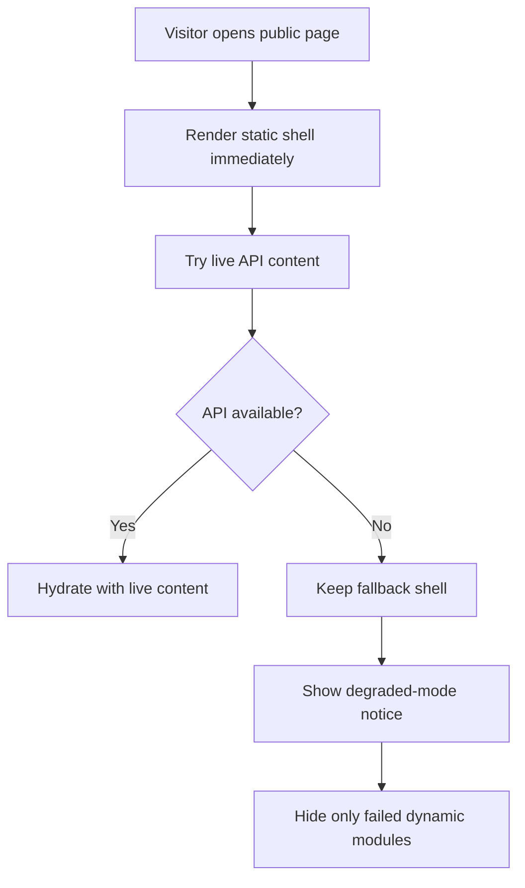

That is the architecture I would trust more for production.

## 12. Loading-State Analysis

You also asked whether it is good to have more than one loading page.

The right answer is:

- yes, if each loading state has a different job
- no, if the user experiences loader-on-top-of-loader confusion

### What exists now

The public app currently has multiple layers of loading behavior:

1. `PageLoader`
   - global boot overlay in `App.tsx`
   - purely frontend-startup oriented
   - not directly tied to API readiness

2. `LoadingSpinner`
   - route-level and section-level data loading
   - used across many pages and components

3. Component-specific loading text
   - for example the jobs block in the career page

4. Local loading suppression logic
   - the spinner registry tries to prevent many concurrent spinners from all showing at once

### My judgment on the current design

It is a bit too fragmented.

The project does not have only "one loading page."
It has:

- a boot overlay
- route-level loading
- section-level loading
- some ad hoc inline loading

That is more than I would want on a polished public site.

### What would be better

I would simplify the model to two levels:

1. One boot-level loader for very first paint only.
2. One consistent section or route skeleton pattern for live data.

I would avoid:

- a global boot loader followed immediately by a second route spinner
- null navigation while waiting
- inconsistent mixes of spinners, text placeholders, and error cards

### Best-practice recommendation

For this project, the cleanest public UX would be:

- immediate shell render
- skeleton sections for content blocks
- persistent navigation and footer fallback
- small inline retry states for failed dynamic modules

That would feel more reliable and more professional.

## 13. Public SEO And Prerendering

The public site is not just a client-side toy app.

It also has a build-time prerendering layer.

### Why that exists

Because public marketing pages need:

- better SEO
- better share metadata
- better first load
- stable route HTML for crawlers

### How it works

The public app:

- builds a client bundle
- builds a server rendering entry
- prerenders routes into static HTML
- generates sitemap and robots files

### Prerendering flow

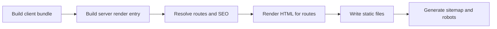

### Important architectural consequence

Even the public build process depends on API-backed content for route SEO and page content decisions.

So this project is not purely static.
It is a database-backed public platform that also prerenders.

## 14. Current Deployment Reality

This is one of the most important migration facts.

The root development aliases now point to `apps/admin-next`.
But the deploy assembly still packages the legacy admin.

### Current deploy diagram

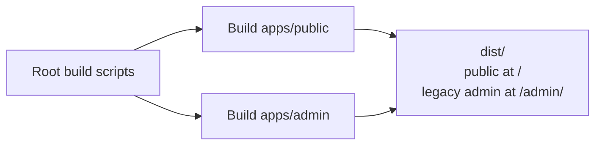

### Target deploy diagram

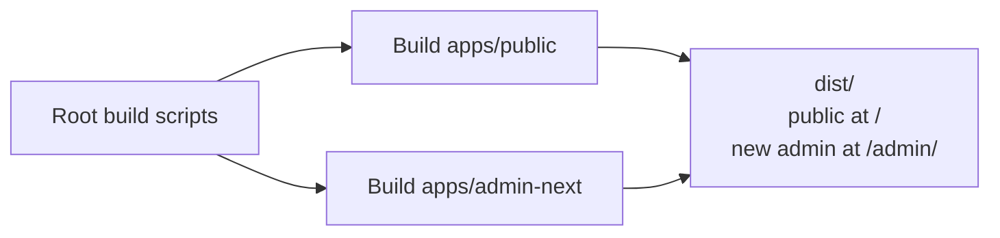

### Why this matters

It means there is currently a migration mismatch between:

- what developers are supposed to build on
- what local dev uses
- what the deploy artifact still packages

Until this is corrected, the architecture is only partially aligned.

## 15. What "Launch" Means In This Project

There are really three meanings of launch here:

### 1. Local launch

Start the services on your machine so you can work.

That means:

- PostgreSQL
- backend
- public frontend
- admin frontend

### 2. Build launch

Generate production-ready frontend artifacts.

That means:

- build public app
- build admin app
- prerender public routes
- assemble deploy output

### 3. Real deployment launch

Serve the built public site and admin from a deployed environment backed by a persistent database.

That final step only becomes trustworthy when:

- the production database is stable
- the correct admin is deployed
- public fallback strategy is improved

## 16. The Best Practical Mental Model

If you remember only one diagram, remember this one:

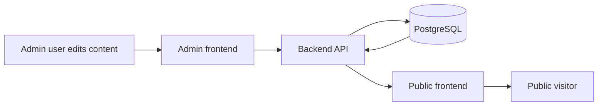

That is the system.

The admin writes.
The database stores.
The public site reads.

## 17. Final Plain-English Takeaway

Here is the honest, plain-language conclusion.

- Yes, this project saves important content to PostgreSQL.
- No, pushing the repo from Windows to Linux does not move the database with it.
- Yes, this explains why code can appear on the second machine while the actual content does not.
- The current public site is visually strong, but architecturally too dependent on a live backend for basic shell content.
- It is acceptable to have more than one loading state, but the current public loading strategy is more fragmented than ideal.
- The deployment story is still transitional because `build:deploy` packages the legacy admin instead of `apps/admin-next`.

If you want the system to feel production-strong, the next big improvements should be:

1. Move to a shared or exportable database workflow across devices.
2. Make the public shell resilient when the backend or DB is down.
3. Simplify loading states into a more intentional hierarchy.
4. Align deployment so the new admin is the one actually shipped.
